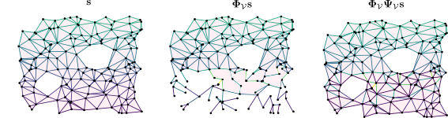

# Signal Compression and Reconstruction on Complexes via Discrete Morse Theory 

[Stefania Ebli], [Celia Hacker], [Kelly Maggs]

[Stefania Ebli]: https://people.epfl.ch/stefania.ebli
[Celia Hacker]: https://www.epfl.ch/labs/hessbellwald-lab/members/celia-hacker/
[Kelly Maggs]: https://people.epfl.ch/kelly.maggs?lang=enstyle=centerme

> This repository contains the code used in the paper [Signal Compression and Reconstruction on Complexes via Discrete Morse Theory].
>
<p align="center">
   
</p>

>
> 
> We provide an approach to signal compression and reconstruction on complexes that leverages the tools of [discrete Morse theory] and [signal processing on complexes]. 
> The main goal is to collapse and reconstruct a complex together with a set of signals on its cells while preserving as much as possible the global topological structure of both the complex and the signal.
> We study how the signal changes under particular types of discrete Morse theoretic collapses, showing its reconstruction error is trivial on specific components of the Hodge decomposition. 
> Furthermore, we provide an algorithm to compute collapses with minimal reconstruction error.

[discrete Morse theory]: https://en.wikipedia.org/wiki/Discrete_Morse_theory
[signal processing on complexes]: https://arxiv.org/abs/1907.11577
[Signal Compression and Reconstruction on Complexes via Discrete Morse Theory]: 

* Paper: [`arXiv:`][paper] 


[paper]: 


## Installation

[][binder]
&nbsp; Click the binder badge to run the code from your browser without installing anything.

[binder]: https://mybinder.org/v2/gh/stefaniaebli/signal-DMTheory

1. Clone this repository.
    ```sh
    git clone https://github.com/stefaniaebli/signal-DMTheory.git
    cd signal-DMTheory
    ```

2. Create the environment.
    ```sh
    CONDA_CHANNEL_PRIORITY=flexible conda env create -f environment.yml
    conda activate sdmt
    ```
## Code
*[file.py]: imple

## Notebooks

* [`bla.ipynb`]: bla
* [`blabla.ipynb`]: blabla
* [`blabla.ipynb`]: blabla


## License & citation

The content of this repository is released under the terms of the [MIT license](LICENSE.txt).
Please cite our paper if you use it.

```
@inproceedings{signal-dmt,
  title = {Signal Compression and Reconstruction on Complexes via Discrete Morse Theory},
  author = {Ebli, Stefania and Hacker, Celia and Maggs, Kelly},
  booktitle = {},
  year = {2021},
  archiveprefix = {arXiv},
  eprint = {2010.03633},
  url = {},
}
```
